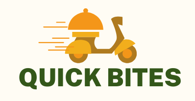

# QuickBites



Welcome to **QuickBites** – Your ultimate food delivery solution designed using the MERN stack. QuickBites brings delicious food to your doorstep with just a few clicks. This README provides all the necessary information about the project, including features, technologies used, setup instructions, and more.

## Table of Contents
1. [Introduction](#introduction)
2. [Features](#features)
3. [Technologies Used](#technologies-used)
4. [Installation](#installation)
5. [Usage](#usage)
6. [Contributing](#contributing)
7. [Contact](#contact)

## Introduction
QuickBites is a full-stack web application that enables users to browse through a variety of restaurants and dishes, place orders, and get food delivered to their doorstep efficiently. The application leverages the power of the MERN stack (MongoDB, Express.js, React.js, Node.js) to ensure a seamless user experience and robust performance.

## Features
- **User Authentication**: Secure login and registration system.
- **Restaurant Browsing**: Explore a variety of restaurants and their menus.
- **Search and Filter**: Easily search for dishes and filter results based on categories, ratings, and more.
- **Order Placement**: Simple and intuitive process for placing orders.
- **Order Tracking**: Real-time tracking of orders from preparation to delivery.
- **Payment Gateway**: Secure payment processing.
- **User Profiles**: Manage user information, order history, and preferences.
- **Admin Dashboard**: Admin interface for managing restaurants, orders, and users.
- **Responsive Design**: Fully responsive design for seamless use on any device.

## Technologies Used
- **Frontend**: 
 
  - React.js: For building the user interface.
  - Redux: For state management.
  
- **Backend**:  
  - Node.js:  For server-side scripting.
  - Express.js: For building the RESTful APIs.
  
- **Database**:
 
  - MongoDB: For storing user, restaurant, and order data.
  
- **Authentication**:
  - JWT (JSON Web Tokens): For secure user authentication.
  
- **Payment Processing**:
  - Stripe: For handling payments.
  
- **Other Tools**:

  - Postman: For API testing.
  - Git: For version control.
  - Vercel: For deployment (optional).

## Installation
To get a local copy up and running, follow these simple steps:

### Prerequisites
- Node.js installed on your local machine.
- MongoDB installed and running.

### Setup

1. **Clone the repository**:
   ```sh
   git clone https://github.com/yourusername/quickbites.git
   cd quickbites
   ```

2. **Install dependencies for both backend and frontend**:
   ```sh
   cd backend
   npm install
   cd ../frontend
   npm install
   ```

3. **Set up environment variables**:
   Create a `.env` file in the `backend` directory and add the following:
   ```env
   MONGO_URI=your_mongo_db_uri
   JWT_SECRET=your_jwt_secret
   STRIPE_SECRET_KEY=your_stripe_secret_key
   ```

4. **Run the application**:
   In the `backend` directory, start the server:
   ```sh
   npm start
   ```
   In the `frontend` directory, start the React app:
   ```sh
   npm start
   ```

5. **Open your browser** and navigate to `http://localhost:3000` to see the application running.

## Usage
- **Sign up** and create a user account.
- **Browse** through restaurants and their menus.
- **Place an order** by adding items to your cart and proceeding to checkout.
- **Track your order** in real-time until it reaches your doorstep.
- **Manage your profile** and view order history from the user dashboard.
- **Admin users** can log in to the admin dashboard to manage restaurants, orders, and users.

## Contributing
Contributions are what make the open-source community such an amazing place to learn, inspire, and create. Any contributions you make are **greatly appreciated**.

1. **Fork the Project**.
2. **Create your Feature Branch** (`git checkout -b feature/AmazingFeature`).
3. **Commit your Changes** (`git commit -m 'Add some AmazingFeature'`).
4. **Push to the Branch** (`git push origin feature/AmazingFeature`).
5. **Open a Pull Request**.


## Contact
Your Name - [nikhilmehlan1234@gmail.com](mailto:your-nikhilmehlan1234@gmail.com.com)

Project Link: [https://github.com/nikhilmehlann/QuickBites](https://github.com/nikhilmehlann/QuickBites)

---

Thank you for checking out QuickBites! We hope you enjoy using it as much as we enjoyed building it. Bon appétit!
